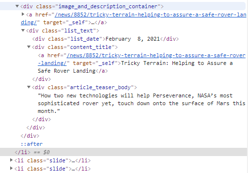
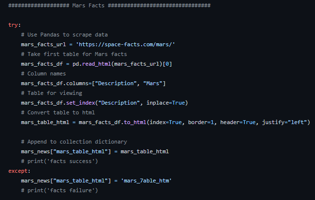
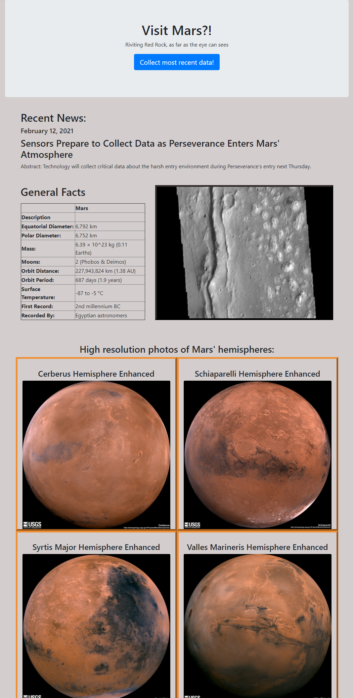

# web-scraping-challenge

This assignment builds a web application that scrapes various websites for data related to the Mission to Mars and displays the information in a single HTML page

Back end searching

 
 * Converted Jupyter notebook into a Python script called scrape_mars.py with a function called scrape that executes all of the scraping code returns one Python dictionary containing all of the scraped data.

* Created a route called /scrape that imports the scrape_mars.py script and calls the scrape function, storing the return value in Mongo as a Python dictionary.

 * Created a root route / that queries the Mongo database and passes the mars data into an HTML template to display the data.

 * Created a template HTML file called index.html that takes the mars data dictionary and displays all of the data in the appropriate HTML elements.

This resulted in a page that looks like the images below:

